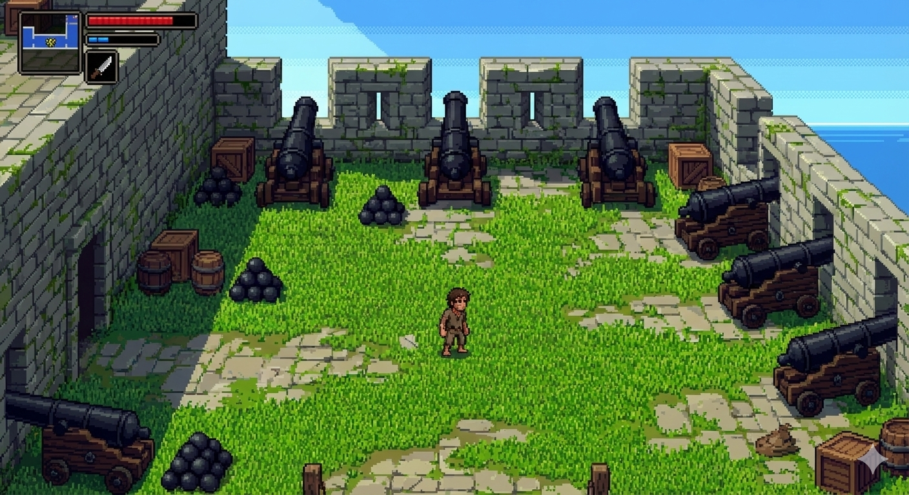

# 🏰 Ecos da Fortaleza: A Fuga de São José

## 📝 Curta Descrição
Um jogo de ação e exploração 2D onde um prisioneiro deve superar as defesas internas de uma fortificação histórica para conquistar sua liberdade.

***

## 🌟 Identidade do Jogo
O jogador assume o papel de um prisioneiro esquecido nas masmorras da histórica Fortaleza de São José de Macapá (ambientação no século XVIII).

O Objetivo Principal é escapar da cela escura, atravessar os corredores e pátios vigiados pela guarda imperial e alcançar o portão final da Fortaleza. Para isso, o jogador precisará encontrar ferramentas improvisadas, enfrentar inimigos e resolver o mistério de como abrir as trancas que o separam da vista do Rio Amazonas.

***

## ⚙️ Descrição da Mecânica
O jogo é um Platformer 2D Side-Scroller com fortes elementos de Metroidvania.

### Mecânicas de Jogo:
* Movimentação: O personagem pode andar lateralmente e pular plataformas (implementação de física de gravidade).
* Combate:** Sistema de ataque corpo-a-corpo simples (faca/soco) para derrotar guardas e animais (ratos).
* Vitória: O jogo termina ao derrotar o **Capitão da Guarda** (Chefe Final) e interagir com o ponto de saída final da Fortaleza.

***

## ✨ Características
* **Ambientação Histórica:** Cenários inspirados na arquitetura real da Fortaleza (tijolos de pedra, grades de ferro, canhões).
* **Atmosfera Progressiva:** O jogo começa **claustrofóbico e escuro** (masmorras) e evolui para ambientes **abertos e iluminados** (pátios internos e muralhas).
* **Dificuldade Crescente:** Inicia apenas com pulos (tutorial), introduz combate e finaliza com um desafio de Chefe.
* **Sistema de Vida:** O jogador possui uma **barra de HP** e o jogo reinicia no último ponto de controle (**checkpoint**) ao morrer.

***

## 🎨 Arte
O projeto será desenvolvido em **2D em Pixel Art** (Estilo **16-bit**, similar aos jogos clássicos de SNES/Genesis).

* **Paleta de Cores:** Uso de cores escuras e dessaturadas (cinza, musgo, marrom) para o interior, contrastando com cores vivas (azul celeste, verde grama, terra vermelha) nos pátios.
* **Iluminação:** Uso de **contrastes fortes** para simular luz de tochas nas masmorras e luz solar forte nos pátios.

***

> **⚠️ AVISO IMPORTANTE:**
> As imagens utilizadas nas seções abaixo foram geradas por Inteligência Artificial (IA) e servem **APENAS** como referência visual (mood board) para a direção de arte e design de nível.

### 1. Ato I: O Início da Fuga (Masmorra)
A cena de introdução foca na atmosfera escura e opressiva da cela, com iluminação de tocha.

### 2. Ato II: O Desafio (Pátio da Fortaleza)
A cena de gameplay principal, mostrando a transição para um ambiente aberto, com luz solar, grama e os canhões da fortaleza.

